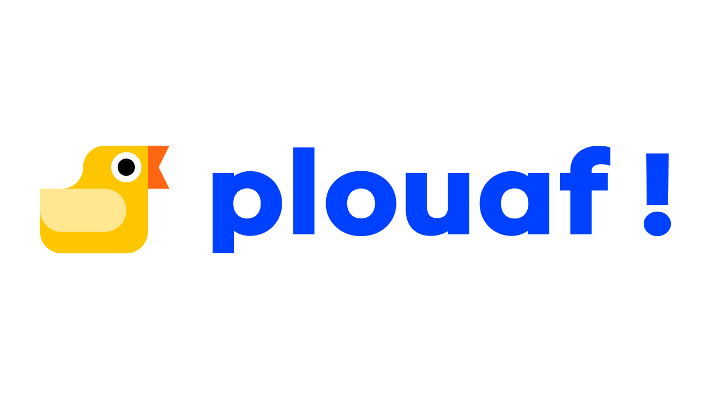

# plouaf!

[plouaf!](https://elo-world.github.io/plouaf) is a simple web app that lets users make random selections in multiple languages. You can, for example, pick a name at random, flip a coin, roll a die, or generate a random number.

# 🛠️ Features

Here are the features available in the plouaf! app:

- Draw lots (Import / Export / Paste list)
- Heads or tails
- Roll a die
- Random number generator

You can also save your lists and share your results.

# 🌍 Languages

There are currently 8 languages available on the app:

- Breton
- English
- French
- Italian
- Spanish
- German
- Ukrainian

# 🎯 To do

- [x] 🖥️ Create a fonctional app.
- [ ] 🦆 Add new duck (for event like a Christmas duck).
- [ ] 🔢 Add a password generator.
